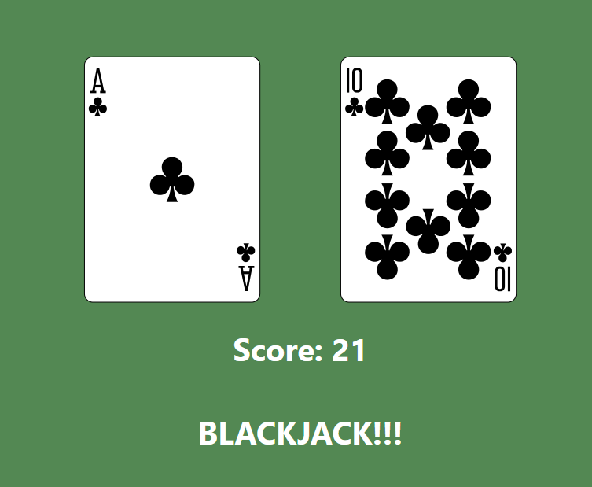

# React - Blackjack
This simple "Blackjack" React app was practice with state control and saving variables in state with "useState". In it, two unique cards are generated, and their Blackjack values are added and displayed. If they total 21, the app will display "BLACKJACK!!!" Refresh to generate new cards.

     

## Running the App
1) Clone repo: `git clone https://github.com/mpike91/React-Blackjack.git`
2) Move into directory: `cd React-Blackjack/`
3) Install npm: `npm install`
4) Start app: `npm start`

## My contribution
No starter code was provided to me. I wrote this app entirely, utlizing create-react-app boilerplate and a playing card API for the images.
